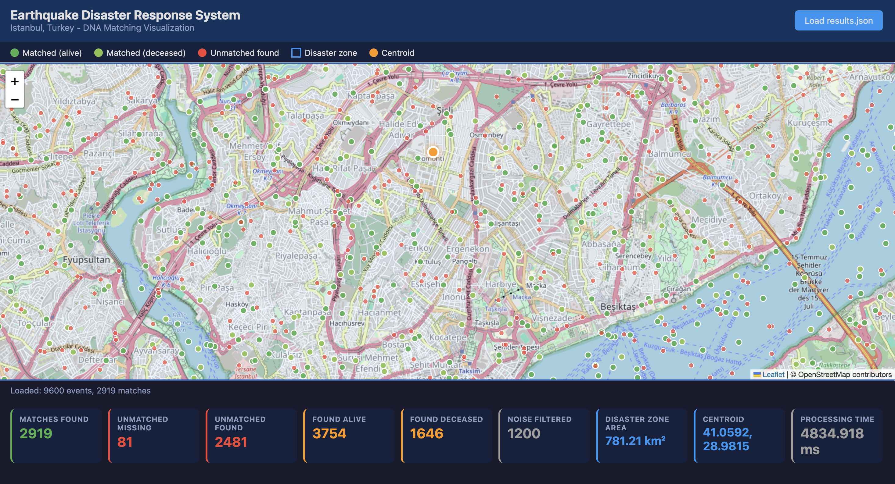

# Earthquake Disaster Response System

## Project Preview

## Key Results

- Processed 9,600 disaster events
- Identified 2,919 DNA matches
- Filtered 1,200 invalid DNA records
- Computed a 781 km² disaster zone
- Generated geographic visualizations and response metrics

## Overview

A Java-based disaster response platform designed to identify and match missing persons and pets using DNA profiles and GPS location data following a large-scale earthquake.

The system processes reports from rescue teams and families, filters invalid DNA samples, identifies potential matches, computes disaster zones, and prioritizes cases for emergency response.

---

## Technologies

- Java
- Gradle
- Data Structures & Algorithms
- Graph Traversal
- Breadth-First Search (BFS)

---

## Key Features

- DNA profile matching and comparison
- Missing-person and pet identification
- Geographic disaster-zone analysis
- Priority-based triage processing
- Event-driven report handling
- Match result generation and reporting

---

## System Architecture

### Engine Components

- **MatchEngine** – coordinates the matching workflow
- **DnaComparator** – compares DNA profiles and computes similarity
- **DisasterZoneCalculator** – determines geographic disaster zones
- **OrganismFilter** – removes invalid or non-human DNA records

### Custom Data Structures

- **CandidateTree** – stores and organizes potential matches
- **EvidenceChain** – tracks supporting evidence for matches
- **MatchStack** – manages matching operations
- **LocationGraph** – models geographic relationships between reports
- **LocusIndex** – accelerates DNA profile lookup

### Domain Models

- DnaProfile
- FoundPerson
- MissingReport
- DisasterZone
- MatchResult

---

## Algorithms

- Breadth-First Search (BFS)
- Graph Traversal
- Similarity-Based DNA Matching
- Geographic Clustering
- Priority-Based Processing

---

## What I Learned

Through this project I gained experience with:

- Designing large Java applications using object-oriented principles
- Implementing custom data structures and graph-based algorithms
- Modeling real-world emergency response systems
- Processing and matching large sets of structured data
- Organizing software into maintainable packages and components
